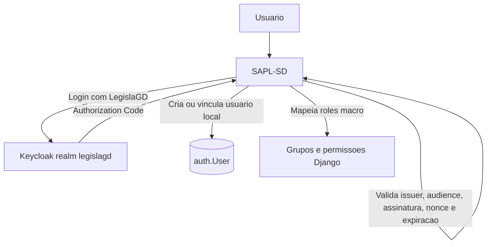

# Analise inicial de SSO do LegislaGD

## Escopo

Esta analise registra o estado atual dos repositorios inspecionados no workspace e define uma proposta incremental para autenticação unificada no ecossistema LegislaGD.

O objetivo arquitetural permanece: Keycloak deve ser a autoridade central de identidade do dominio Legislativo, usando OpenID Connect / OAuth 2.0 com Authorization Code Flow e PKCE quando aplicavel. O Poder Executivo nao deve compartilhar usuarios, senhas, banco de identidade ou permissoes com o Legislativo.

## Repositorios analisados

| Componente | Caminho analisado | Papel atual |
| --- | --- | --- |
| LegislaGD | `C:\LegislaGD` | Agregador de infraestrutura, documentacao e orquestracao local. |
| SAPL-SD | `C:\SAPL-SD` e modulo em `modules/SAPL-SD` | Sistema legislativo Django. |
| SIGI-SD | `C:\SIGI-SD` e modulo em `modules/SIGI-SD` | Backend administrativo/atendimento em Symfony e stack Docker com Chatwoot. |
| e-Cidade-SD | `C:\e-Cidade-SD` | Sistema legado PHP/Laravel com autenticacao propria. |
| Chatwoot | via imagem Docker em SIGI-SD | Atendimento web Rails, sem checkout de fork local nesta analise. |

## Infraestrutura atual

O LegislaGD ja possui uma infraestrutura central em `infrastructure/compose/`:

- `docker-compose.proxy.yml` sobe Traefik na rede Docker `legislagd`.
- `docker-compose.database.yml` sobe PostgreSQL central `legislagd-postgres`.
- `overrides/sapl.legislagd.yml` conecta o SAPL-SD ao Traefik e ao PostgreSQL central.
- `overrides/sigi.legislagd.yml` conecta SIGI-SD, Chatwoot, worker, Redis e servicos auxiliares ao Traefik central.

O PostgreSQL atual cria bases separadas para SAPL, SIGI e Chatwoot dentro de uma mesma instancia. Para a primeira implantacao, o Keycloak tambem usara essa instancia central, mas com database, usuario e senha proprios. Isso reduz custo operacional no ambiente local sem compartilhar schema ou credenciais com os demais sistemas.

Hosts locais ja usados:

- `sapl.legislagd.localhost`
- `sigi.legislagd.localhost`
- `chat.sigi.legislagd.localhost`
- `portal.legislagd.localhost`
- `ecidade.legislagd.localhost` planejado, mas e-Cidade ainda fora da subida principal
- `proxy.legislagd.localhost`

## Situacao atual por sistema

### LegislaGD

O repositorio LegislaGD e atualmente um agregador de infraestrutura e governanca. Nao foi identificado um portal de autenticacao proprio com modelo de usuario local neste repositorio. O README descreve o LegislaGD como coordenador dos modulos, com Traefik, banco central e comandos `make up`, `make up sapl`, `make up sigi`.

O ponto de entrada funcional mais proximo de "portal de modulos" hoje esta no SAPL-SD, em `sapl/legislagd.py`, que monta cards de integracao conforme configuracoes `LEGISLAGD_*`.

### SAPL-SD

Tecnologia principal:

- Django 2.2.
- `AUTH_USER_MODEL = 'auth.User'`.
- Django REST Framework com `TokenAuthentication` e `SessionAuthentication`.
- Permissoes e grupos nativos do Django.

Login atual:

- `sapl/settings.py` define `LOGIN_URL = '/login/?next='`, `LOGIN_REDIRECT_URL = '/'` e `LOGOUT_REDIRECT_URL = '/login'`.
- `sapl/base/views.py` define `LoginSapl`, uma `LoginView` customizada que usa `authenticate()` e `login()`.
- `sapl/base/urls.py` registra `/login/` e `/logout/`.
- `sapl/base/tests/test_login.py` cobre login e logout locais.

Usuarios e permissoes:

- Usuarios estao em `auth.User`.
- Grupos e permissoes usam `django.contrib.auth.models.Group` e `Permission`.
- Existem CRUDs administrativos de usuario em `sapl/base/views.py`.
- Existe grupo conceitual `Usuários com Login Social` em `sapl/rules`, mas a busca inicial nao encontrou implementacao OIDC/OAuth social ativa.

Integracoes LegislaGD:

- `sapl/legislagd.py` monta cards para SIGI, Chatwoot, e-Cidade, Portal e Plataforma360.
- Hoje os cards exigem apenas `user.is_authenticated` quando `login_required=True`; ainda nao ha filtragem por roles macro como `sapl.operador`, `sigi.atendente` ou `chatwoot.agent`.

Conclusao para piloto:

SAPL-SD e o melhor primeiro alvo de teste. A integracao deve ser aditiva: adicionar "Login com LegislaGD" via OIDC, preservar `/login/` local para contingencia administrativa e mapear roles Keycloak para grupos/permissoes Django sem substituir toda a autorizacao interna.

### SIGI-SD

Tecnologia principal:

- PHP >= 8.4.
- Symfony 8.
- Doctrine ORM.
- Symfony Security Bundle.
- Bootstrap/Twig/UX.

Login atual:

- `apps/backend-symfony/config/packages/security.yaml` usa provider Doctrine `App\Entity\User` por `username`.
- Firewall `main` usa `form_login`, `remember_me` e `logout`.
- `apps/backend-symfony/src/Controller/SecurityController.php` renderiza `/login`.
- `apps/backend-symfony/src/Entity/User.php` persiste `username`, `email`, `password` e `roles`.

Usuarios e permissoes:

- Usuarios locais em tabela `users`.
- Roles internas principais: `ROLE_USER` e `ROLE_ADMIN`.
- Autorizacao usa roles Symfony e atributos `IsGranted`.

Conclusao:

SIGI-SD esta bem posicionado para OIDC nativo em Symfony, mas deve vir depois do piloto no SAPL-SD, para reaproveitar as decisoes de realm, claims e provisionamento sem mexer em dois frameworks ao mesmo tempo.

### Chatwoot

Situacao atual:

- Chatwoot roda como imagem `chatwoot/chatwoot:latest` dentro do `docker-compose.yml` do SIGI-SD.
- O LegislaGD sobrescreve banco e Traefik em `infrastructure/compose/overrides/sigi.legislagd.yml`.
- Nao ha checkout local do codigo Chatwoot nesta analise.
- Nao foi identificada configuracao SSO/OIDC no compose atual.

Risco:

Por estar como imagem upstream e por SSO poder depender de recursos/licenca conforme edicao e versao do Chatwoot, qualquer alteracao deve ser precedida por `docs/architecture/chatwoot-sso.md`.

Conclusao ajustada ao plano de validacao:

Depois que o SAPL-SD funcionar com Keycloak, Chatwoot deve ser o segundo alvo de analise pratica, mas com uma etapa documental antes de alterar imagem, fork ou core.

### e-Cidade-SD

Tecnologia principal:

- PHP >= 5.6.4.
- Laravel 5.4 em partes do sistema.
- Codigo legado procedural extenso.
- PostgreSQL.
- Laravel Passport e `lcobucci/jwt` para APIs.

Login atual:

- `login.php` monta a tela de login.
- O envio de credenciais usa `DB_login` e `DB_senha`; a senha e calculada com MD5 no cliente antes do envio.
- `libs/db_conecta.php` valida a presenca de `$_SESSION['DB_login']` e `$_SESSION['DB_id_usuario']`, abre conexao PostgreSQL e salva sessoes.
- `app/User.php` aponta para `configuracoes.db_usuarios`, chave primaria `id_usuario`, e implementa metodos para Laravel Passport.

Usuarios e permissoes:

- Usuarios principais estao em `configuracoes.db_usuarios`.
- Sessao e autorizacao dependem fortemente de variaveis `DB_*`.
- Permissoes aparecem vinculadas a menus e funcoes legadas, por exemplo `db_permissaomenu`.

Conclusao:

O e-Cidade-SD deve ser tratado como legado. A integracao recomendada e uma camada adaptadora OIDC que cria/recupera a sessao esperada pelo sistema, sem reescrever login, permissoes ou estrutura de usuarios nesta fase.

## OIDC/OAuth/SSO existente

Nao foi encontrada implementacao Keycloak/OIDC/SAML ativa nos pontos centrais dos repositorios analisados.

Achados relevantes:

- SAPL-SD usa autenticacao local Django e DRF token/session.
- SIGI-SD usa autenticacao local Symfony `form_login`.
- e-Cidade-SD possui Laravel Passport para OAuth de API, mas isso nao substitui SSO web via OIDC.
- Chatwoot esta consumido como imagem Docker, sem configuracao SSO visivel no compose.

## Ordem incremental recomendada

A ordem de implantacao deve priorizar validacao pequena e reversivel:

1. Etapa 2: adicionar infraestrutura Keycloak no LegislaGD.
2. Etapa 3: integrar SAPL-SD primeiro.
3. Etapa 4: analisar e integrar Chatwoot, evitando dependencia Enterprise e documentando riscos de fork.
4. Etapa 5: integrar SIGI-SD.
5. Etapa 6: planejar e integrar e-Cidade-SD por adaptador legado.
6. Etapa 7: amadurecer portal LegislaGD, provisionamento, auditoria e interoperabilidade futura.

Essa ordem difere da ordem tecnica original para favorecer validacao progressiva: SAPL-SD primeiro, depois Chatwoot, depois SIGI-SD e demais sistemas.

## Proposta para o piloto SAPL-SD

Fluxo inicial:



Requisitos do piloto:

- Manter login local `/login/` para administracao e contingencia.
- Criar endpoint separado para iniciar OIDC, por exemplo `/auth/legislagd/login/`.
- Criar callback OIDC, por exemplo `/auth/legislagd/callback/`.
- Salvar o `sub` do token como identificador externo principal.
- Vincular usuario existente por e-mail apenas durante migracao controlada.
- Mapear roles macro Keycloak para grupos Django.
- Nao armazenar senha, access token completo, refresh token ou client secret em logs.

Campo externo:

Como `auth.User` e modelo Django padrao, evitar trocar `AUTH_USER_MODEL` nesta fase. Preferir modelo auxiliar no SAPL-SD, por exemplo `OidcIdentity`, com relacao `OneToOneField` para `auth.User` e campos:

- `provider`
- `subject`
- `email_at_login`
- `last_login_at`

## Realm, clients e roles iniciais

Realm:

- `KEYCLOAK_REALM=legislagd`

Clients separados:

- `legislagd`
- `sapl`
- `sigi`
- `chatwoot`
- `ecidade`

Roles macro iniciais:

- `legislagd.admin`
- `legislagd.user`
- `sapl.admin`
- `sapl.operador`
- `sapl.parlamentar`
- `sapl.consulta`
- `sigi.admin`
- `sigi.supervisor`
- `sigi.atendente`
- `chatwoot.admin`
- `chatwoot.agent`
- `ecidade.admin`
- `ecidade.rh`
- `ecidade.folha`
- `ecidade.compras`
- `ecidade.contabilidade`
- `ecidade.patrimonio`

Keycloak deve controlar identidade e perfis macro. Permissoes detalhadas continuam em cada aplicacao.

## Riscos principais

- SAPL-SD usa Django 2.2 e `auth.User`; bibliotecas OIDC modernas podem exigir versoes mais novas. A dependencia precisa ser escolhida com compatibilidade real.
- Trocar `AUTH_USER_MODEL` no SAPL-SD seria uma migracao de alto risco e nao deve ser feito no piloto.
- Chatwoot em imagem `latest` reduz previsibilidade. A versao deve ser fixada antes de qualquer customizacao.
- SSO no Chatwoot pode esbarrar em recursos de edicao/licenca; e preciso confirmar estrategia self-hosted antes de implementar.
- e-Cidade-SD mistura legado procedural, Laravel e sessoes `DB_*`; uma integracao invasiva pode quebrar permissoes por menu e auditoria.
- O ambiente local usa HTTP. Para homologacao/producao, cookies seguros, redirects e emissores OIDC devem usar HTTPS.
- Single Logout precisa ser desenhado com suporte real dos clientes, evitando hacks com iframe.

## Decisoes arquiteturais iniciais

- Keycloak sera infraestrutura do LegislaGD, nao repositorio separado nesta fase.
- O banco do Keycloak deve ser proprio e isolado.
- O realm deve ser generico (`legislagd`), sem nome de municipio hardcoded.
- Cada sistema tera seu proprio client OIDC.
- O piloto sera SAPL-SD primeiro.
- Login local administrativo deve permanecer ate o SSO estar validado.
- O `sub` OIDC sera a chave primaria externa de identidade.
- E-mail pode ser usado para vinculacao inicial, mas nao deve ser identificador permanente.
- Roles macro no Keycloak nao substituem permissoes internas detalhadas.
- Legislativo e Executivo permanecem dominios de identidade independentes.

## Proximas entregas recomendadas

Etapa 2 deve criar:

- Compose de Keycloak apontando para banco e usuario proprios no PostgreSQL central.
- `.env.example` com variaveis de identidade.
- Realm exportavel/importavel com clients e roles iniciais.
- Healthchecks.
- Documentacao inicial em `docs/architecture/authentication.md`, `authorization.md`, `sso.md`, `user-provisioning.md` e `interoperability.md`.

Etapa 3 deve alterar apenas o SAPL-SD:

- Configuracoes OIDC por variavel de ambiente.
- Rotas de login/callback/logout OIDC.
- Modelo auxiliar para identidade externa.
- Provisionamento JIT.
- Mapeamento minimo de roles para grupos.
- Testes para usuario autenticado, sem role, com role, token invalido e logout.

## Comandos uteis para continuar

Subir somente a base integrada atual:

```bash
make up sapl
```

Ver URLs locais:

```bash
make urls
```

Rodar testes de login existentes do SAPL-SD:

```bash
pytest sapl/base/tests/test_login.py
```

## Status da Etapa 1

Etapa 1 concluida no nivel de analise inicial. Nao foram implementadas integracoes completas, conforme solicitado.
