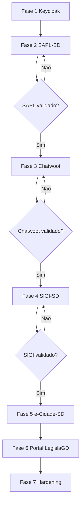

# Plano de implantacao SSO do LegislaGD

## Objetivo

Implantar autenticacao unificada no ecossistema LegislaGD usando Keycloak como provedor central de identidade do Poder Legislativo, com OpenID Connect / OAuth 2.0 e Authorization Code Flow.

A implantacao deve ser incremental, reversivel e validada sistema por sistema. O primeiro piloto sera o SAPL-SD.

## Principios

- Keycloak sera a autoridade central de identidade legislativa.
- Cada sistema tera seu proprio client OIDC.
- O banco do Keycloak sera proprio e isolado.
- O login local administrativo sera mantido ate o SSO estar validado.
- O `sub` OIDC sera o identificador externo principal.
- E-mail podera ser usado apenas para vinculacao inicial controlada.
- Roles no Keycloak serao macroperfis; permissoes detalhadas continuam nas aplicacoes.
- Legislativo e Executivo permanecem dominios de identidade separados.
- Nenhuma senha, client secret, access token completo ou refresh token deve ser registrado em log.

## Ordem de implantacao

1. Infraestrutura Keycloak no LegislaGD.
2. Piloto SAPL-SD.
3. Chatwoot.
4. SIGI-SD.
5. e-Cidade-SD.
6. Portal LegislaGD e refinamentos finais.

## Fase 0 - Preparacao

### Entregas

- Confirmar branches de trabalho dos repositorios.
- Congelar versoes de imagens Docker criticas, principalmente Chatwoot.
- Confirmar URLs locais e de homologacao.
- Definir nomes de realm, clients, hosts e variaveis.
- Criar checklist de rollback por sistema.

### Criterios de aceite

- Ambiente local atual sobe sem SSO.
- SAPL-SD continua acessivel por login local.
- Traefik e banco central atuais continuam funcionando.
- Documento `docs/architecture/sso-analysis.md` revisado.

## Fase 1 - Infraestrutura Keycloak

### Escopo

Adicionar Keycloak ao LegislaGD sem integrar ainda as aplicacoes.

### Entregas

- Compose para `keycloak`.
- Database e usuario proprios do Keycloak no PostgreSQL central.
- Healthchecks para Keycloak e PostgreSQL.
- Labels Traefik para `id.legislagd.localhost`.
- Variaveis no `.env.example`.
- Realm inicial `legislagd`.
- Clients iniciais:
  - `legislagd`
  - `sapl`
  - `sigi`
  - `chatwoot`
  - `ecidade`
- Roles iniciais por aplicacao.
- Documentacao de execucao local.

### Variaveis esperadas

```env
KEYCLOAK_REALM=legislagd
KEYCLOAK_HOST=id.legislagd.localhost
KEYCLOAK_FRONTEND_URL=http://id.legislagd.localhost
KEYCLOAK_ADMIN_USER=admin
KEYCLOAK_ADMIN_PASSWORD=change_me
KEYCLOAK_DB_NAME=keycloak
KEYCLOAK_DB_USER=keycloak
KEYCLOAK_DB_PASSWORD=change_me
```

### Criterios de aceite

- Keycloak abre em `http://id.legislagd.localhost`.
- Realm `legislagd` existe.
- Client `sapl` existe.
- Roles SAPL iniciais existem.
- Banco `keycloak` e usuario `keycloak` existem no PostgreSQL central.
- Nenhum segredo real foi commitado.
- SAPL-SD, SIGI-SD e Chatwoot continuam subindo como antes.

### Rollback

- Remover os arquivos compose/override do Keycloak da chamada de subida.
- Derrubar container Keycloak.
- Preservar ou remover manualmente o banco `keycloak` conforme politica de rollback do ambiente.
- Manter bancos dos sistemas inalterados.

## Fase 2 - Piloto SAPL-SD

### Escopo

Adicionar login OIDC ao SAPL-SD mantendo login local.

### Entregas

- Configuracoes OIDC por variavel de ambiente.
- Botao ou link "Login com LegislaGD".
- Endpoint de inicio do login OIDC.
- Endpoint de callback.
- Validacao de issuer, audience, assinatura, expiracao, state e nonce.
- Modelo auxiliar para vincular usuario local ao `sub` OIDC.
- Provisionamento Just-In-Time.
- Mapeamento minimo de roles Keycloak para grupos Django.
- Logout local preservado.
- Preparacao para RP-Initiated Logout.
- Testes automatizados focados no fluxo novo.

### Decisao tecnica recomendada

Como o SAPL-SD usa `auth.User`, nao trocar `AUTH_USER_MODEL`. Criar modelo auxiliar, por exemplo:

```text
OidcIdentity
- user
- provider
- subject
- email_at_login
- last_login_at
```

### Mapeamento inicial

| Role Keycloak | Acao inicial no SAPL-SD |
| --- | --- |
| `sapl.admin` | Vincular a grupo administrativo existente ou superuser somente se explicitamente definido. |
| `sapl.operador` | Vincular a grupo operacional SAPL configurado. |
| `sapl.parlamentar` | Vincular a grupo parlamentar/autor quando aplicavel. |
| `sapl.consulta` | Criar usuario ativo sem permissoes administrativas. |

O mapeamento exato deve respeitar grupos reais existentes na instancia.

### Cenarios de teste

- Usuario anonimo acessa SAPL-SD.
- Usuario usa login local normalmente.
- Usuario inicia "Login com LegislaGD".
- Callback valido autentica e cria sessao Django.
- Usuario existente e vinculado por e-mail durante migracao.
- Usuario ja vinculado e localizado por `sub`.
- Usuario sem role SAPL nao recebe permissoes indevidas.
- Issuer invalido falha.
- Token expirado falha.
- State/nonce invalido falha.
- Logout local encerra sessao SAPL.

### Criterios de aceite

- Login local continua funcionando.
- Login OIDC funciona com usuario de teste.
- Usuario local e criado ou vinculado corretamente.
- `sub` fica persistido.
- Grupos Django sao aplicados conforme roles macro.
- Nenhum token completo aparece em log.
- Testes de login existentes continuam passando.

### Rollback

- Desabilitar OIDC por variavel de ambiente.
- Manter login local `/login/`.
- Ignorar tabela auxiliar `OidcIdentity` sem apagar usuarios.

## Fase 3 - Chatwoot

### Escopo

Validar SSO no Chatwoot sem dependencia Enterprise ou SaaS obrigatorio.

### Entregas

- Fixar versao da imagem Chatwoot.
- Criar `docs/architecture/chatwoot-sso.md`.
- Confirmar se a edicao usada suporta SSO/OIDC nativamente.
- Se nao suportar, definir estrategia self-hosted:
  - fork controlado;
  - proxy/adaptador;
  - ou integracao customizada minima.
- Criar client Keycloak `chatwoot`.
- Validar login com agente de teste.

### Criterios de aceite

- Chatwoot continua self-hosted.
- Nao ha dependencia de licenca Enterprise apenas para autenticacao.
- Agente consegue acessar via Keycloak.
- Login local/admin de contingencia permanece disponivel durante piloto.
- Worker do Chatwoot continua processando normalmente.

### Rollback

- Retornar imagem Chatwoot anterior.
- Remover variaveis SSO.
- Manter banco Chatwoot intacto.

## Fase 4 - SIGI-SD

### Escopo

Adicionar OIDC ao backend Symfony do SIGI-SD.

### Entregas

- Client Keycloak `sigi`.
- Configuracoes OIDC por variavel.
- Authenticator Symfony para OIDC ou bundle compativel.
- Provisionamento/vinculacao por `sub`.
- Campo auxiliar de identidade externa no usuario ou tabela relacionada.
- Mapeamento:
  - `sigi.admin` -> `ROLE_ADMIN`
  - `sigi.supervisor` -> role local equivalente, se criada
  - `sigi.atendente` -> `ROLE_USER` ou role operacional propria
- Testes funcionais de login e autorizacao.

### Criterios de aceite

- Login local Symfony continua funcionando.
- Login OIDC cria sessao Symfony.
- Roles sao mapeadas sem ampliar permissao indevidamente.
- Areas `ROLE_ADMIN` continuam protegidas.
- Logout local e logout central documentados.

### Rollback

- Desabilitar authenticator OIDC.
- Manter `form_login`.
- Preservar usuarios locais.

## Fase 5 - e-Cidade-SD

### Escopo

Planejar e implementar adaptador OIDC para sistema legado.

### Entregas

- Documento tecnico de pontos de login/sessao.
- Client Keycloak `ecidade`.
- Adaptador que autentica via Keycloak e cria sessao local esperada.
- Vinculacao de `sub` a usuario `configuracoes.db_usuarios`.
- Preservacao de variaveis `DB_*` necessarias.
- Login administrativo local de emergencia.

### Criterios de aceite

- Usuario autorizado entra via Keycloak.
- Sessao e permissoes por menu continuam funcionando.
- Sistema nao exige senha local do Keycloak.
- Nao ha reescrita ampla do legado.

### Rollback

- Desabilitar rota/adaptador OIDC.
- Voltar para `login.php`.
- Manter usuarios e permissoes locais.

## Fase 6 - Portal LegislaGD

### Escopo

Consolidar o LegislaGD como entrada institucional.

### Entregas

- Login central no portal.
- Cards por roles macro.
- Links para SAPL-SD, SIGI-SD, Chatwoot e e-Cidade-SD.
- Ocultacao de cards sem role.
- Aviso/estado para usuario sem acesso a modulos.
- Logout central via Keycloak.

### Criterios de aceite

- Usuario faz login uma vez.
- Modulos permitidos aparecem conforme roles.
- Acesso real continua protegido no sistema destino.
- Logout encerra sessao central quando suportado.

## Fase 7 - Hardening e operacao

### Entregas

- HTTPS obrigatorio em homologacao/producao.
- Cookies Secure, HttpOnly e SameSite adequados.
- MFA opcional por grupo, inicialmente administradores e TI.
- Auditoria minima por aplicacao.
- Politica de ciclo de vida de usuarios.
- Plano de backup/restore do Keycloak.
- Plano de rotacao de client secrets.
- Runbook operacional.

### Criterios de aceite

- Ambiente de homologacao validado com HTTPS.
- Restore do banco Keycloak testado.
- MFA testado com usuario administrador.
- Logs nao contem segredos.
- Documentacao de rollback aprovada.

## Checklist por sistema antes de avancar

Antes de passar para o proximo sistema:

- Login local ainda funciona.
- Login SSO funciona.
- Logout foi validado ou limitacao foi documentada.
- Provisionamento foi validado.
- Usuario sem role nao ganha acesso indevido.
- Usuario com role ganha apenas o acesso esperado.
- Testes automatizados principais passam.
- Rollback foi testado ou documentado.
- Riscos residuais foram registrados.

## Linha de validacao sugerida



## Proxima acao recomendada

Iniciar a Fase 1 com uma alteracao pequena no LegislaGD:

- adicionar compose do Keycloak;
- adicionar database e usuario proprios do Keycloak no PostgreSQL central;
- expor `id.legislagd.localhost` no Traefik;
- atualizar `.env.example`;
- documentar como subir e acessar o admin.

Somente depois disso iniciar codigo no SAPL-SD.
